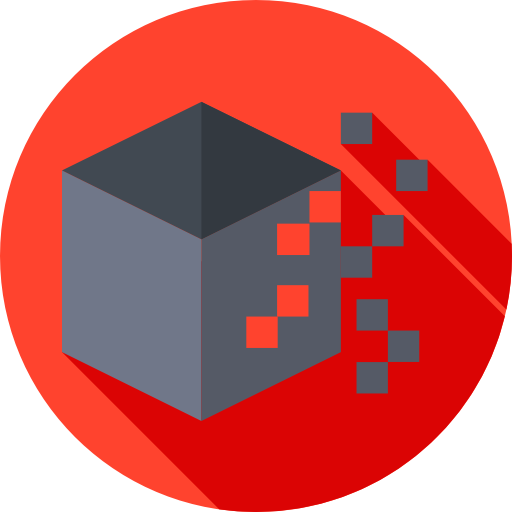

<p align="center">
<a href="https://github.com/BizarreNULL/shell-robot/">
  
</a>
</p>
<h1 align="center">
  Shell Robot - <code>template2shell</code>
</h1>

<p align="center">
  Check available templates on <a href="https://github.com/BizarreNULL/shell-robot-templates">shell-robot-templates</a>.
  <br/><br/>
  <a href="http://www.wtfpl.net/txt/copying/">
    
  </a>
  
</p>


## Why?

Playing CTFs or even on red teaming workflow, is necessary to memorize a huge collection of reverse shell templates (one-liners or not) for PHP, Linux, macOS, or based in some chaining with some tools. The time lost writing a *revshell* can be the same to lose the time window for persisting access.

The ShellRobot library exposes a very simple API (check the code snippet bellow) to automate the creation of any kind of reverse shell (or things that can be put on our template configuration file), and as a dotnet Core 3.X library, can be integrated on any dotnet program, like CLIs or REST APIs for automatic *revshells* based in some parameters.

```csharp
// Make a new instance of the library
var shellRobot = new ShellRobot();

// Hits shell-robot-templates to find new templates
await shellRobot.UpdateAsync();

// Parse any valid template by title, with their specific parameters
var revshell = await ParseTemplateAsync("Some random complex revshell", new[]
{
    "param1",
    "value of param1",
    "param2",
    "..."
});
```


## How to set library custom working directory?

The library needs internet connection for the first run, or a custom repository for the templates witch can be accessble by the host network. By default, on the default application constructor (`ShellRobot()`) is checked if on the current environment exist a value for the variable `SHELLROBOT_HOME`, if it is null or empty, the application default os pointed to your operational system application data folder, like `%appdata%\.shellRobot` on Windows.


## How to bake a template?

Let's create one by example. The current engine waits for a JSON file, with the following skeleton:

```json
{
    "title": "hello",
    "author": "ShellRobot",
    "description": "Just an example of how to create a template",
    "args": {
        "name": {
            "mandatory": true,
            "pattern": "{{name}}",
            "validations": {
                "anyMatch": false,
                "expressions": [
                    {
                        "description": "Only letters allowed",
                        "expressions": [
                            ""
                        ]
                    }
                ]
            }
        }
    },
    "template": "Hello {{name}}!"
}
```

The syntax is really simple and self-explanatory, on `anyMatch` key, you can configure if the regexes in `expressions` list need to match only with one, or all the regular expressions on this list. Also, is possible to configure multiple regular expressions on nested list `expressions` - maybe this will change on future, also PRs are accepted - to deep validate the `args` type.

> Maybe adding native C# types? Tell me what you think is better on [issues](https://github.com/BizarreNULL/shell-robot/issues).

Key-value of `args` objects represents the parameter name, on this example, the first object key value is `name`, and to parse correctly the template, we can call the function `ParseTemplateAsync` of the library API with `name \"Foo Bar\"`.

For every `expression`, is possible to explain what it does in `description` field. The `pattern` represents wherein  the `template` the validated input will be replaced. We do in this way because the default value to specify a `template` can crash some *revshells* (like the classic `{{}}`).

After creating a new template, you can open a PR on the [shell-robot-templates](https://github.com/BizarreNULL/shell-robot-templates) repository, then this template will be available to the entire community.

## Roadmap

I started the project for learning a bit more about C# 9.0, but as the maturity of `ShellRobot` library is groing, maybe someday can turn in a really useful thing:

- [x] **0x00**: Make the satuday project work;
- [x] **0x01**: Documentation of `.json` template configuration (check example [here](https://github.com/BizarreNULL/shell-robot-templates/blob/main/bash-tcp.json));
- [ ] **0x02**: Create GitHub Action for validate new PRs with new templates on the [other](https://github.com/BizarreNULL/shell-robot-templates) _repo_;
- [ ] **0x03**: Create GitHub Action for CD of the library on NuGet;
- [ ] **0x04**: Make a CLI (or webapi) consuming the `ShellRobot` library and community templates. 


## Licenses

[Shell Robot](https://github.com/BizarreNULL/shell-robot) project icons made by <a href="https://www.flaticon.com/authors/freepik" title="Freepik">Freepik</a> from <a href="https://www.flaticon.com/" title="Flaticon">www.flaticon.com. The source code is licensed under [WTFPL](http://www.wtfpl.net/).</a>